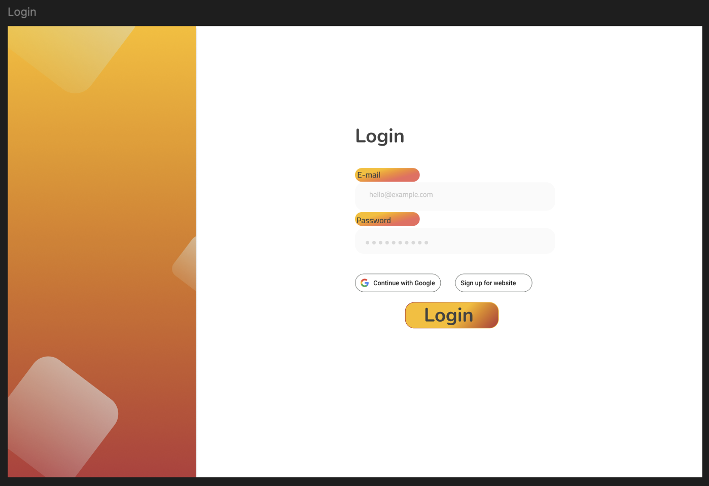

# CS260 - My Startup Specification

## Elevator pitch
Cookies have become a source of outrage and public outcry, and not the sweet kind. After laws enforcing websites to ask if they can record cookies on you, this begs the question what sort of data is being kept on me? This website will show possible data that websites can access by reading your cookies from popular websites, by using our own database to track information on you, and using your IP address to locate you.

## Design

[View Figma](https://www.figma.com/design/dDcDPbFcEek6dWbKmcUnAh/Untitled?node-id=2-479&t=r9M2pkdplgVOkDiT-1)

## Key Features
- Login securely using HTTPS or google.
- Looks up your location using API and IP Address.
- Stores info about you in database.
- Looks at cookies from other sites.
- Displays information found back to user.

## Technologies
- HTML - Uses correct HTML structure for application. Three to two HTML pages. One for login, another for registry, and one for displaying details about the user. 
- CSS - Application styling that looks good on different screen sizes, uses good whitespace, color choice and contrast.
- React - Provides login, displayment of all information gathered, and use of React for routing and components.
- Service - Backend service with endpoints for:
    - login
    - retrieving amount of times logged in
    - looking at cookie data
    - calling api to find location and time at location
- DB/Login - Store users and amount of times logged in database. Also stores credentials for users, which will allow for register and login of users. Will not look at details page unless authenticated.
- WebSocket - Sends realtime location and of current time found from logged in user's ip address.

# Deliverables 
## HTML deliverable

## CSS deliverable

## Javascript deliverable

## React deliverable

## Service deliverable

## Database deliverable

## WebSocket deliverable

# My Notes
[Notes file](notes.md)