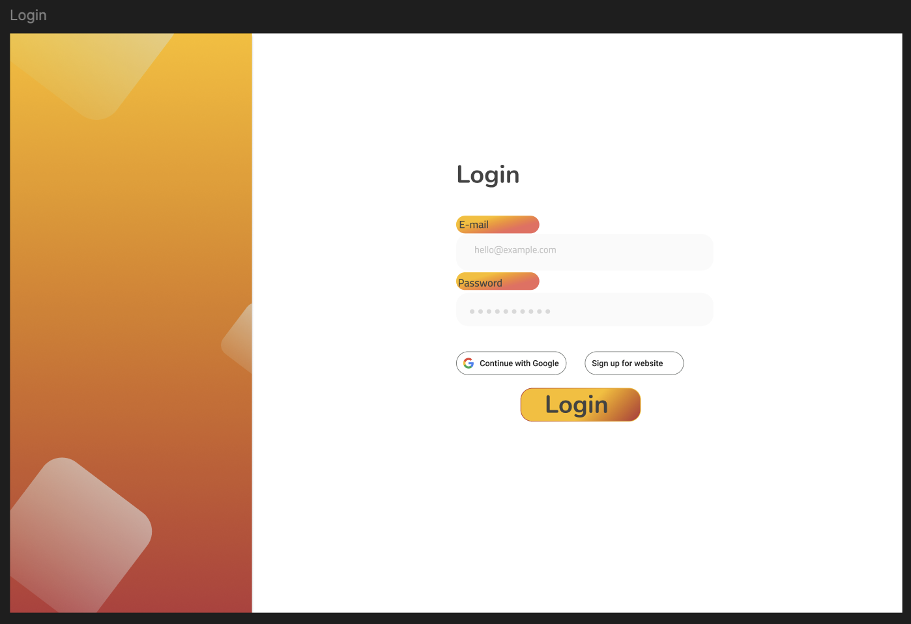
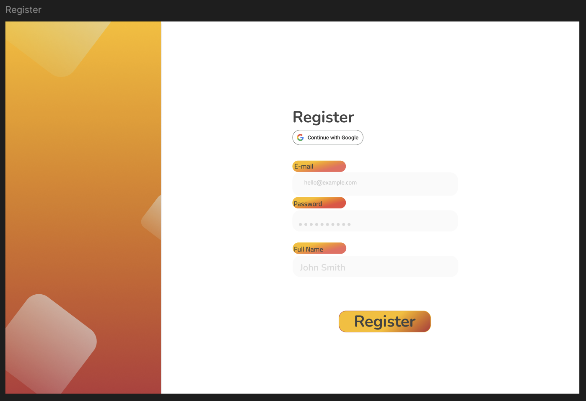
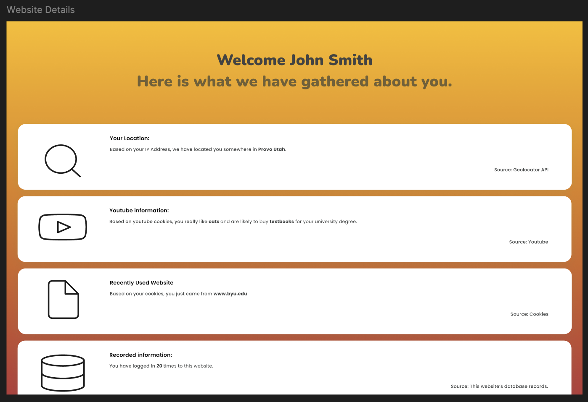

# CS260 - My Startup Specification

## Elevator pitch
Cookies have recently become a source of outrage and public outcry, but unfortunately, it’s not about the sweet kind. Many websites ask if they can store cookies on your device, which raises the question: what kind of data is being collected about me? This website will demonstrate the potential data websites can access. This website will read your cookies from popular sites, use our own database to track information about you, and locate you through your IP address.

## Design

[View Figma](https://www.figma.com/design/dDcDPbFcEek6dWbKmcUnAh/Untitled?node-id=2-479&t=r9M2pkdplgVOkDiT-1)

## Key Features
- Login securely using HTTPS or google.
- Looks up your location using API and IP Address.
- Stores info about you in database.
- Looks at cookies from other sites.
- Displays information found back to user.

## Technologies
- HTML - Uses correct HTML structure for application. Three to two HTML pages. One for login, another for registry, and one for displaying details about the user. 
- CSS - Application styling that looks good on different screen sizes, uses good whitespace, color choice and contrast.
- React - Provides login, displayment of all information gathered, and use of React for routing and components.
- Service - Backend service with endpoints for:
    - login
    - retrieving amount of times logged in
    - looking at cookie data
    - calling api to find location and time at location
- DB/Login - Store users and amount of times logged in database. Also stores credentials for users, which will allow for register and login of users. Will not look at details page unless authenticated.
- WebSocket - Sends realtime location and of current time found from logged in user's ip address.

# Deliverables 
## HTML deliverable
Created detail and login (index) HTML pages that contains everything that the user will be able to click or mess with.
Added images to the project. Deployed on AWS.

Changed some of the images used compared to the mockup I gave based on what SVGs I could get for free.

## CSS deliverable
Created CSS files for footer, header, and the two HTML pages. Details and Login (index) have custom CSS. Kept a lot of the original orange theming, and made sure everything looked good viewed even when the page got tiny. Learned and used PicoCSS for the fun of it, and so I wouldn't have to use @media sizes as well to help with colors.

Changes compared to mockup
- Changed to a dark asthetic
- Changed appearance of login and sign up pages because my mockup was ugly and I didn't like them.
- Removed google login because that was out of scope for this class.

## React deliverable
Created:
- Header & footer components
- Login page is now separate from App
- Creates jsx for login and details pages
- Now is forced to authenticate before using the app
- Removed/extrapilated a lot of duplicate code, and put it into header/footer components, or the main App.jsx

Changes:
- Can no longer use header to navigate, only log out. (Aka, can't go to details page when not logged in)
- Removed out-of-scope functionality, such as analyzing user's cookies. Now will only make an API call and store user's info. As is the expectation for CS260 (I believe)
- Slight CSS changes

## Service deliverable

## Database deliverable

## WebSocket deliverable

# My Notes
[Notes file](public/notes.md)